# Spider Quiz

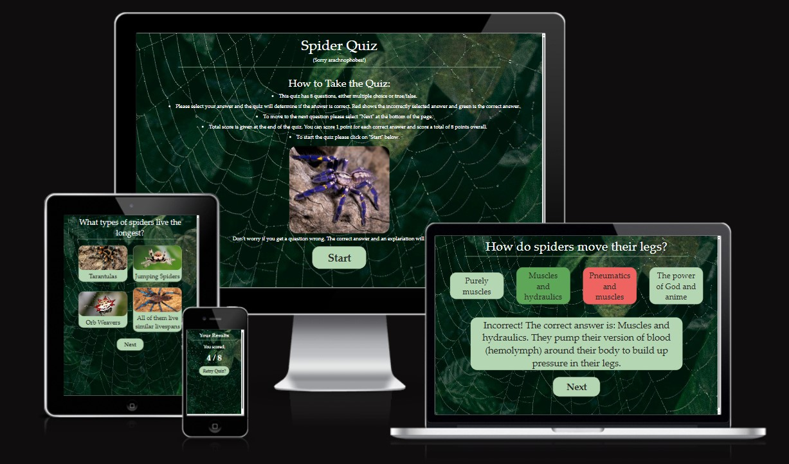

## Introduction

This README file provides information about the Spider Quiz website, its purpose, and how to get started. The quiz allows visitors to test and grow their knowledge of spiders with 8 questions and accompanying explanations. The questions are randomised throughout the quiz and provides education on spiders to its users.

Please click this [link](https://fae-coded.github.io/SpiderQuiz/index.html) to access the website.

## Features

The website has three pages with several features:

- The first page shows how to take the quiz and the rules. At the top of the page, the name of the quiz (Spider Quiz) can be seen in large text and below it in smaller text apologies to archnaphobes.
- When clicked a Start button centered at the bottom of the page will start the quiz.

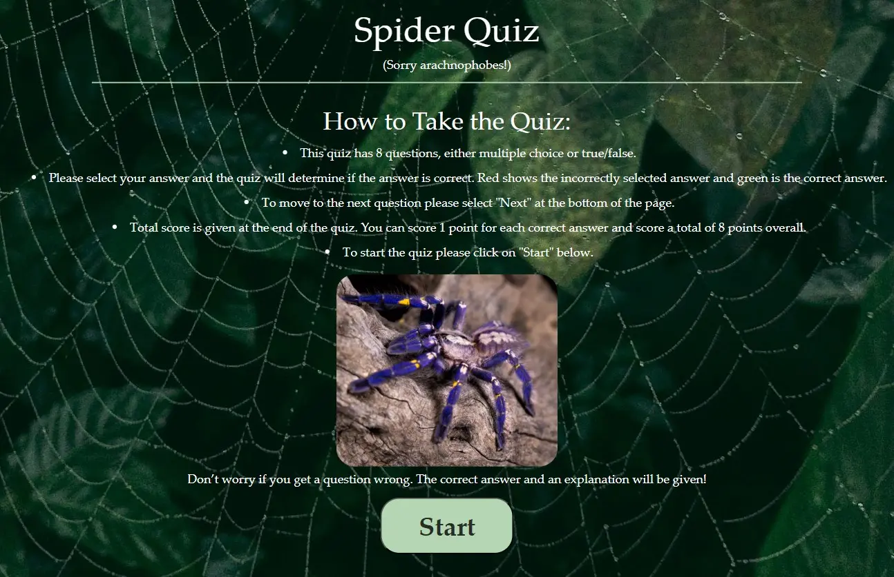

- On the second page, the first question is randomly selected and populated from the list of questions available.
- All questions are cycled through at random.
- All buttons offer the user feedback with on-hover animations and pointers.

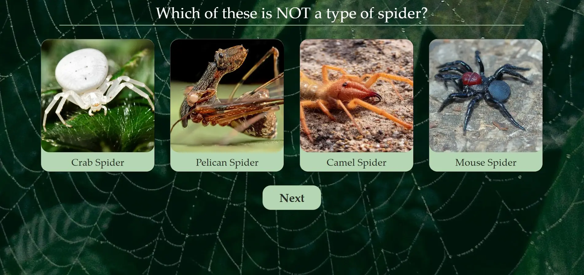

- A correct answer will highlight the button green and an explanation for the answer appears between the answers and next buttons.

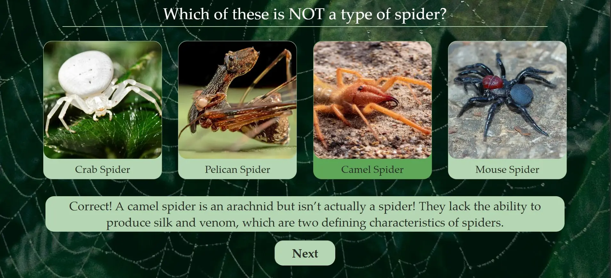

- An incorrect answer will highlight the selected answer red.
- The correct answer is highlighted in green at the same time and the explanation for the correct answer is provided.

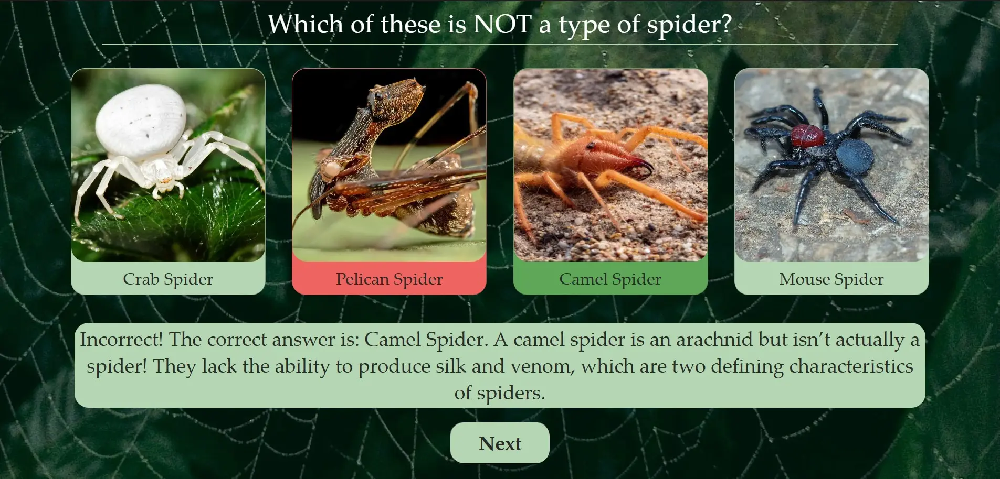

- Afterwards the answer buttons are disabled and the next button will activate so the user can move to the next question.
- Once all questions are answered the next button will redirect the user to the results page.
- The final page shows the users their total score for the quiz.
- A Retry Quiz button allows the user to reset the quiz and navigate back to the start page.

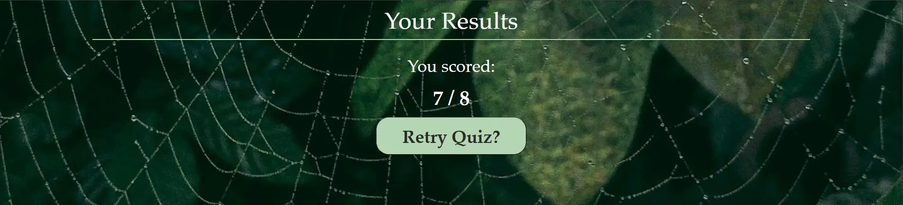

- Responsive on laptop screen sizes and larger, text and images scale up. Responsive on tablet and mobile screen sizes, text and images shrink down.

## Future Enhancements

- Running total score and questions left during quiz.
- Something special for a perfect score.
- 4k resolution media query.

## Technologies Used

- [HTML](https://developer.mozilla.org/en-US/docs/Web/HTML) was used for the structure of the site.
- [CSS](https://developer.mozilla.org/en-US/docs/Web/css) was used to add styles and layout to the site.
- [CSS Flexbox](https://developer.mozilla.org/en-US/docs/Learn/CSS/CSS_layout/Flexbox) was used to arrange items symmetrically on the pages.
- [JavaScript](https://developer.mozilla.org/en-US/docs/Web/JavaScript) was used to create all the logic necessary to make the quiz work.
- [VSCode](https://code.visualstudio.com/) was used as the main tool to write and edit code.
- [Git](https://git-scm.com/) was used for the version control of the website.
- [GitHub](https://github.com/) was used to host the code of the website.
- [Figma](https://www.figma.com/) was used for producing initial wireframes. Initial Wireframe can be viewed [here](https://www.figma.com/design/mAnQRCXJfvqxyJP7CIBFQE/Spood-Quiz?node-id=0-1&p=f&t=YKhmV9zmjSKGVbFS-0).
- [Phind](https://www.phind.com/) used as a troubleshoot tool.

## Testing

The initial html test for index.html revealed an error with the button element nested inside the anchor element. I fixed this error by removing the anchor element and adding an onClick attribute to the button directing to questions.html.

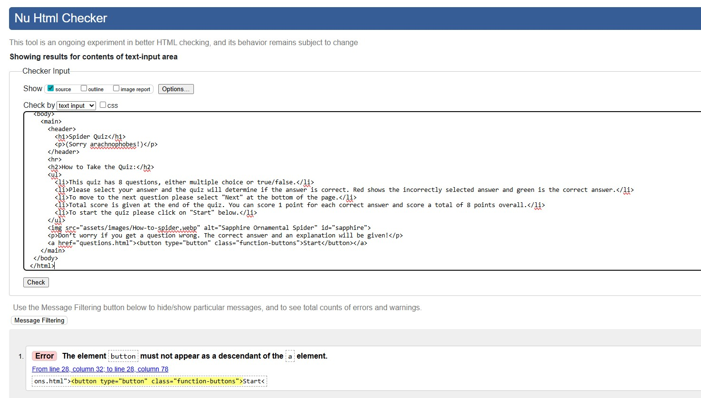

The initial html test for questions.html showed an error due to mistaken use of backslashes in the script path and a warning for the h1 element with id questionHeader being empty. I corrected the backslashes to forward slashes in the path and added placeholder text "Loading question..." to the h1 element.

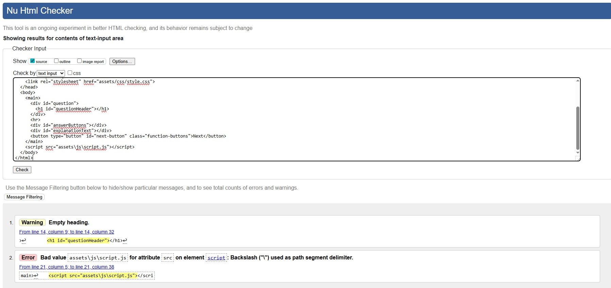

Before testing results.html I noticed similar issues found in questions.html and index.html were present, therefore I corrected backslashes in the script path and amended the button element to have an onClick attribute, instead of using an anchor element. Once these corrections were made to results.html I ran an initial test which returned no errors or warnings.

All HTML files have now passsed HTML validity checks with W3C.

- index.html file test:
  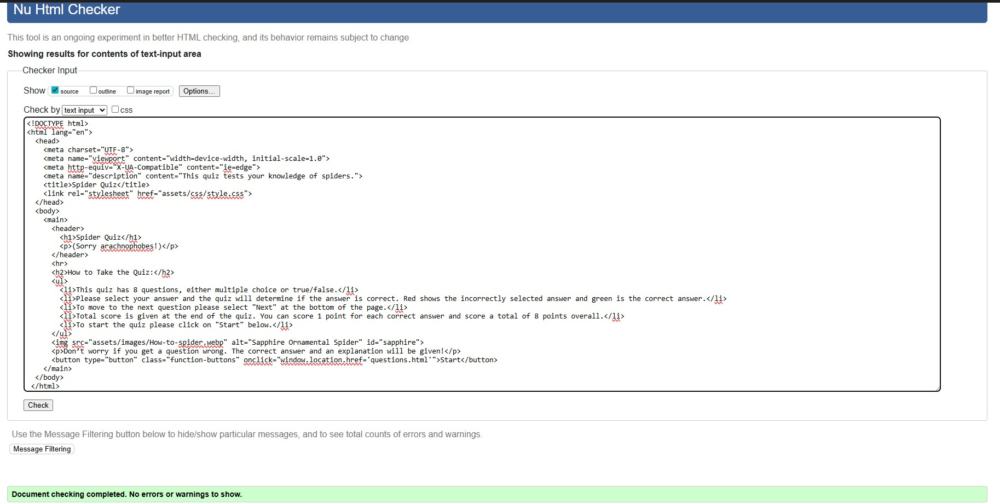

- questions.html file test:
  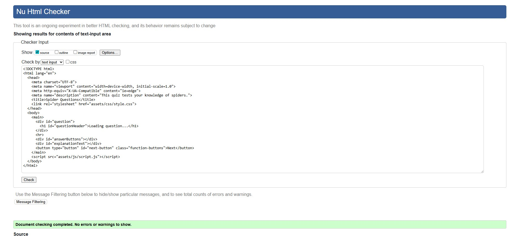

- results.html file test:
  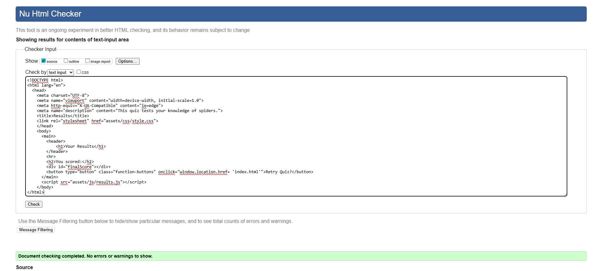

The CSS file has passed CSS validity check with W3C too.

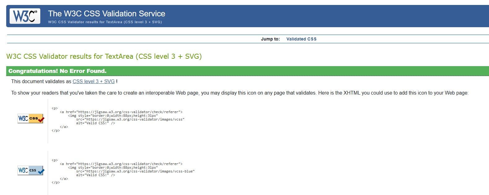

The Javascript files have been tested with JSHint and no errors were found.

The website has been tested for performance, accessibility, best practice and SEO using Lighthouse for both desktop and mobile.

During the initial lighthouse tests for question pages including images an accessibility issue raised was the alt image text and text underneath the images were duplicated. Both the alt text and button text were pulling from the answers property in the array. Therefore I decided to remove the alt text from the images to avoid confusion for screen readers and allow just the button text to be read.

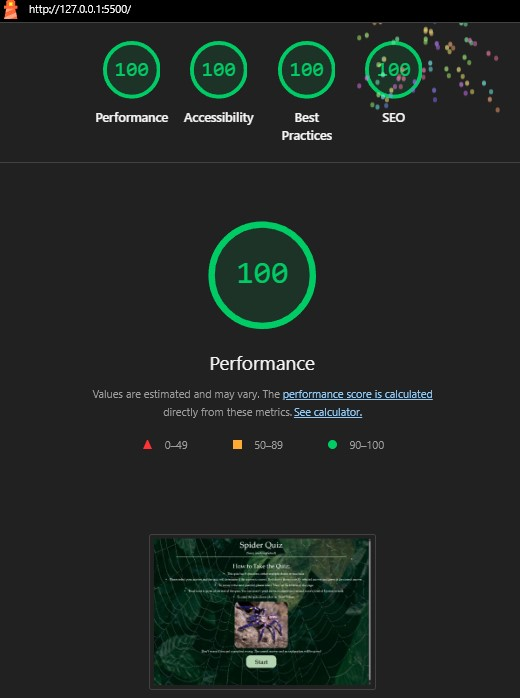
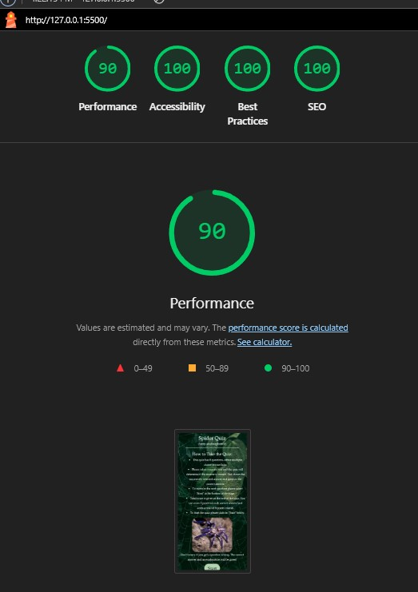

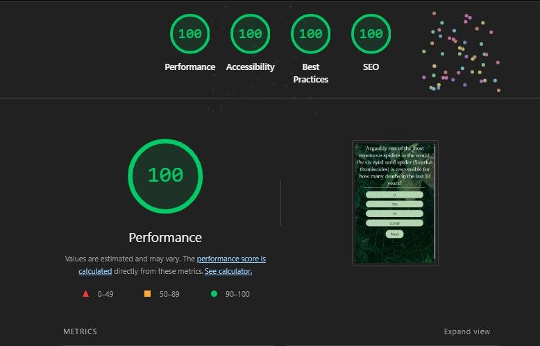
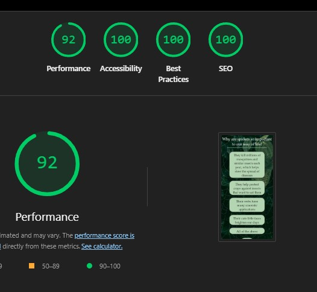

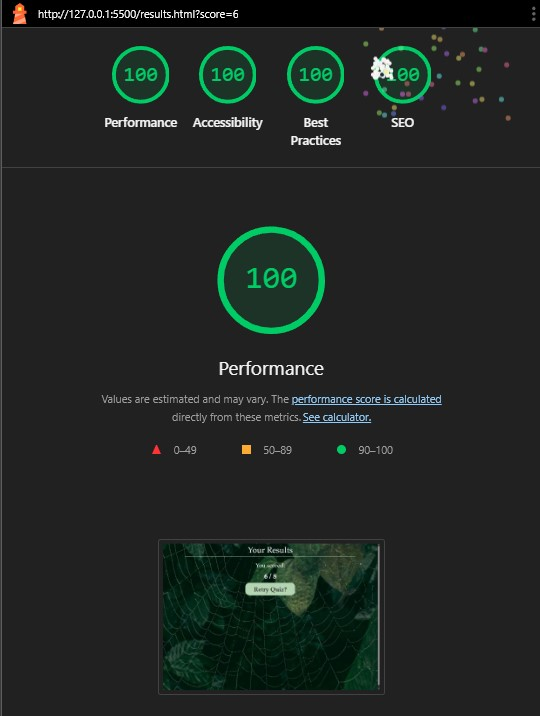
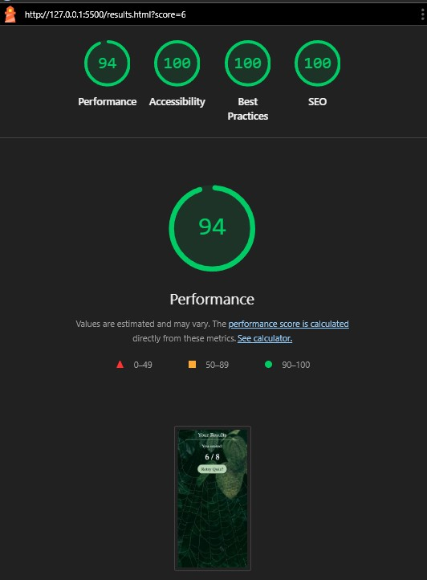

## Deployment

The site was deployed to GitHub pages. The steps to deploy are as follows:

- In the [GitHub repository](https://github.com/Fae-coded/SpiderQuiz), navigate to the Settings tab
- From the source section drop-down menu, select the **Main** Branch, then click "Save".
- The page will be automatically refreshed with a detailed ribbon display to indicate the successful deployment.

The live link can be found [here](https://fae-coded.github.io/SpiderQuiz/questions.html)

## Credits

### - Inspiration

    - My good friend Freddie for their amazing spider knowledge and providing the questions for this quiz!
    - My partner Laurie for being the best rubber duck.
    - My mentor Andy for his guidance, feedback and encouragement.

### - Image Sources

    - https://www.evolutionreptiles.co.uk/animals/spiders/gooty-sapphire-ornamental-tarantula/?srsltid=AfmBOoq0E4ur3SKLEa5XEuZkSlFPF7igrA_QmO23INdndeQ0LTMNqszm
    - https://www.pexels.com/photo/a-spider-web-with-water-droplets-14477251/
    - https://drivebyeexterminators.com/everything-to-know-about-crab-spider/
    - https://www.inaturalist.org/taxa/416710-Archaeidae
    - https://a-z-animals.com/animals/camel-spider/
    - https://australian.museum/learn/animals/spiders/red-headed-mouse-spider-missulena-occatoria/
    - https://www.discoverwildlife.com/animal-facts/insects-invertebrates/tarantula-facts
    - https://avonturia.com/all-about-keeping-jumping-spiders/
    - https://www.southcarolinapublicradio.org/show/naturenotes/2023-10-25/spiny-backed-orb-weaver-spider
    - https://pocerias.ch/en/display-insects/tarantulas/birupes-simoroxigorum/sw11118.2
    - https://www.harvst.co.uk/how-to-grow-peas/?srsltid=AfmBOoqVPEotTP-4sUPKvmCfwO_7f8W9pR9GlvqSiZtxlQuN2cafMmio
    - https://www.allrecipes.com/recipe/234374/apple-hand-pies/
    - https://www.plumgarths.co.uk/shop/extra-large-eggs/
    - https://stargirl.fandom.com/wiki/Keith_David
    - https://favicon.io/emoji-favicons/spider/
